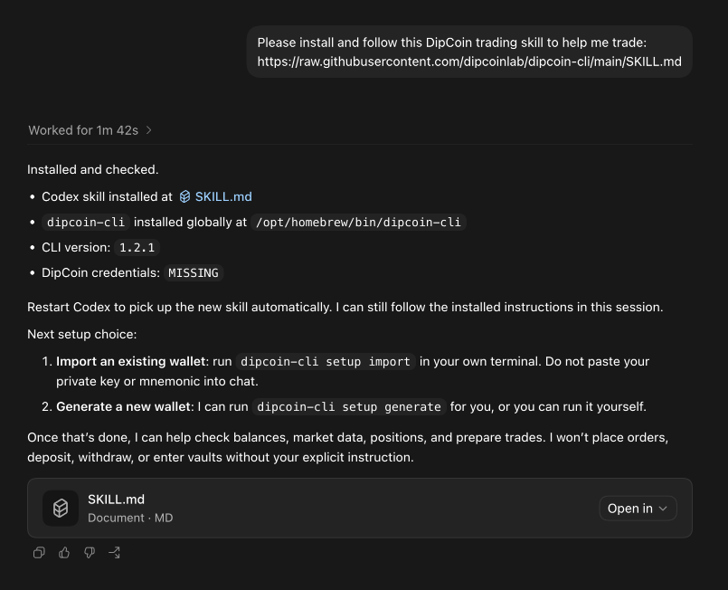
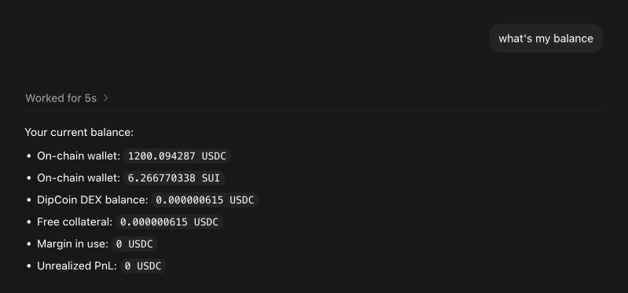
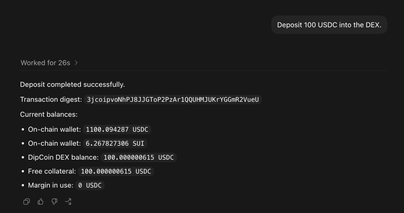
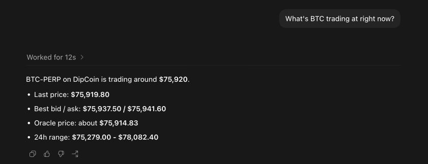
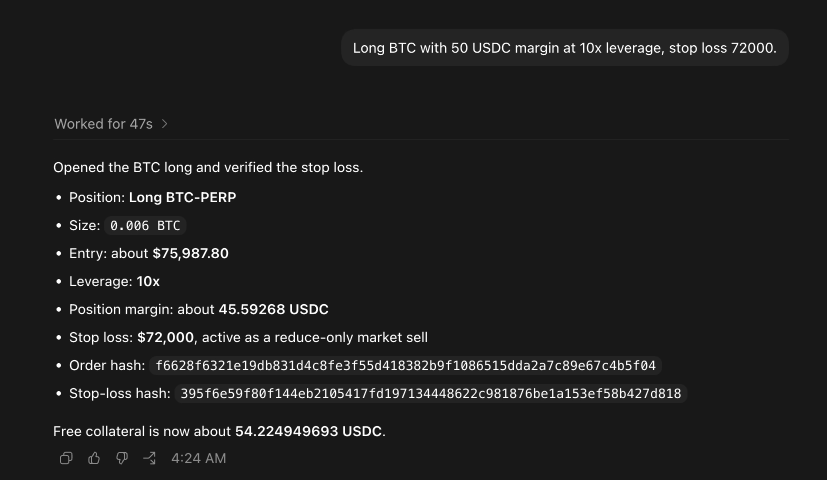
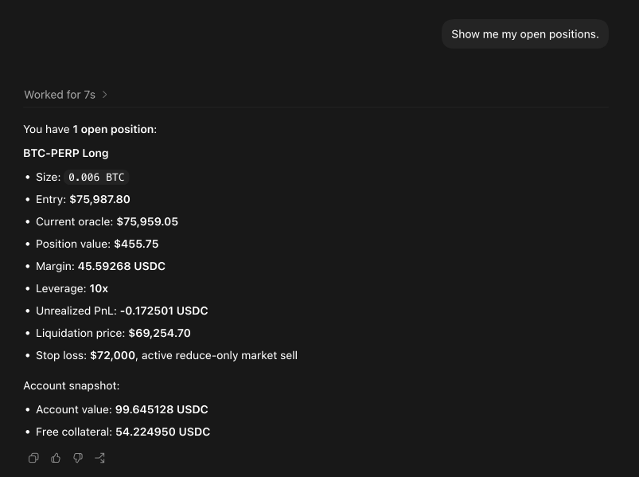
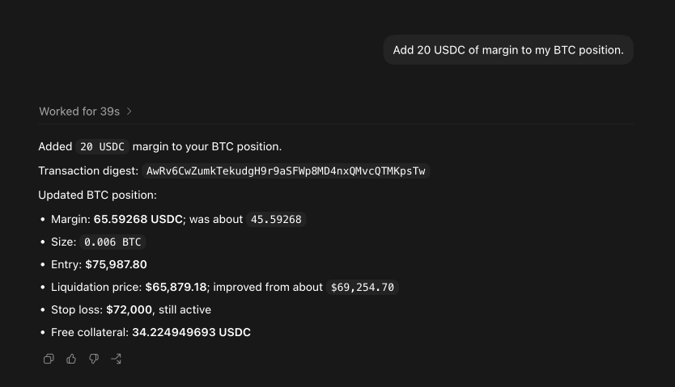
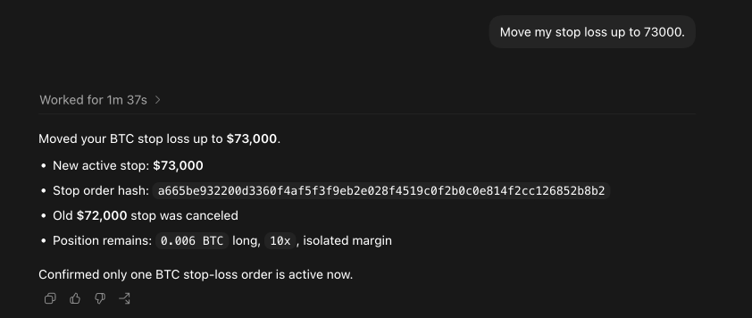
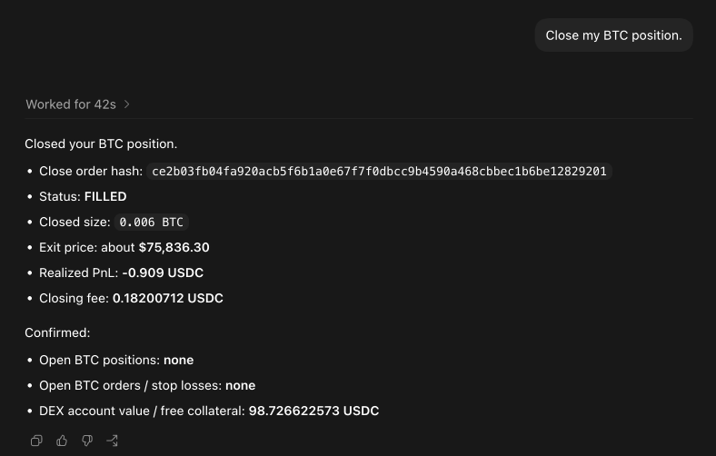
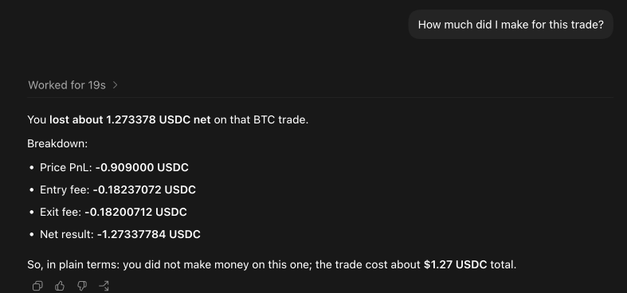

# How to Vibe Trading on DipCoin

**Vibe trading** means you do not need to click through charts, memorize CLI commands, or manage every step by hand. You describe what you want in plain English, such as "buy BTC", "show my position", or "close the trade", and your AI agent uses `dipcoin-cli` to help you.

This guide walks you through the setup. It usually takes about 5 minutes.

---

## What You Need

- An **AI coding agent** installed on your computer. Any agent that can run local commands should work. We recommend one of these:
  - **OpenAI Codex**
  - **Anthropic Claude Code**
  - **OpenClaw**
- A small amount of **SUI** in your wallet for on-chain gas fees. Around 1 SUI is usually enough to get started.
- Some **USDC** to trade with. Your SUI and USDC must both be on the **Sui network**.

---

## Step 1 - Ask Your AI Agent to Load the DipCoin Skill

Open your AI agent (`codex`, `claude`, OpenClaw, or whichever tool you prefer).

Paste this message into the chat:

```text
Please install and follow this DipCoin trading skill to help me trade:
https://raw.githubusercontent.com/dipcoinlab/dipcoin-cli/main/SKILL.md
```

Your AI agent will:

1. Fetch and read the DipCoin skill.
2. Install `dipcoin-cli`.
3. Walk you through the next steps.

You do not need to memorize any commands. Follow the agent's prompts, review each action carefully, and approve it only when it looks correct.



---

## Step 2 - Set Up Your Wallet

Your AI agent will ask which wallet setup you want to use.

### Option A - Import an existing Sui wallet

If you already have a Sui wallet, the agent will ask you to run a setup command in your **own terminal**, not in the chat. The command opens a hidden prompt where you can paste your private key (`suiprivkey1...`) or mnemonic. Your secret is not shown in the terminal and should never be pasted into the AI chat.

### Option B - Generate a new Sui wallet

If you do not have a Sui wallet yet, ask your AI agent to generate one for you. The agent will create a new wallet, save it locally, and show you a Sui address that you can fund.

> Your private key or mnemonic is stored in `~/.config/dipcoin/env`. If you lose this file and do not have a backup, you can permanently lose access to your funds. Back it up somewhere safe and never share it.

No matter which option you choose, make sure your Sui wallet has both:

- **SUI** for gas fees.
- **USDC** for trading collateral.

Then ask your agent:

> **You:** What's my balance?

The agent will check both your wallet balance and your DipCoin DEX balance.



---

## Step 3 - Fund the DipCoin DEX

After your wallet has USDC on Sui, you need to deposit some USDC into the DipCoin DEX before you can trade.

> **You:** Deposit 100 USDC into the DEX.

The agent should show you the deposit details before submitting the transaction. Review the amount, then confirm if everything looks right.



---

## Step 4 - Start Vibe Trading

Now you can trade by talking to your agent. Here are some example prompts you can use.

### Check the market

> **You:** What's BTC trading at right now?



### Open a position

> **You:** Long BTC with 50 USDC margin at 10x leverage, stop loss 72000.



### Check your open positions

> **You:** Show me my open positions.



### Manage risk

> **You:** Add 20 USDC of margin to my BTC position.



> **You:** Move my stop loss up to 73000.



### Close a position

> **You:** Close my BTC position.



> **You:** How much did I make on this trade?



That is the core workflow: ask your AI agent, review the action, confirm it, and let the agent submit the trade.

---

## Other Things You Can Ask

- *"Show me the top-performing vaults."*
- *"Deposit 200 USDC into vault X."*
- *"Cancel all my open orders on ETH."*
- *"Withdraw 500 USDC from the DEX back to my wallet."*
- *"What's my profit and loss this week?"*

Vaults work like managed trading pools: you deposit USDC, and a vault manager trades on behalf of the vault.

---

## Six Safety Rules

1. **Never paste your private key or mnemonic into the chat.** The setup flow uses a hidden terminal prompt. If an AI agent asks you to paste secrets into chat, refuse.
2. **Always review trade details before confirming.** AI agents can misunderstand your intent. Check the symbol, side, margin, leverage, order type, stop loss, and take profit.
3. **Start small.** Try a small trade first so you understand the workflow before committing meaningful funds.
4. **Respect leverage.** 10x leverage can multiply profits, but it also multiplies losses. A 10% move against a 10x position can wipe out the margin.
5. **Use a stop loss.** Add instructions like *"with a stop loss at X"* when opening a position.
6. **Back up `~/.config/dipcoin/env`.** This file controls access to your wallet. Keep it private and store a backup securely.

---

## Where to Go Next

- Full skill reference: [SKILL.md](https://raw.githubusercontent.com/dipcoinlab/dipcoin-cli/main/SKILL.md)
- DipCoin website: <https://dipcoin.io>
- Vault discovery prompt: *"Find me a good vault to deposit into."*

Vibe trading is simple, but it still uses real funds. Trade carefully and confirm every action before it is submitted.
